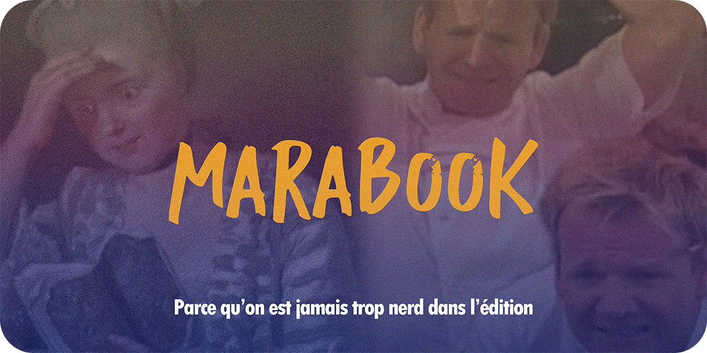
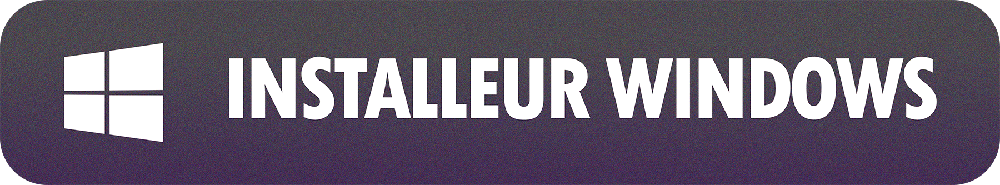

  

  
  

# Marabook

Auteurs, éditeurs, ceci est le dernier logiciel dont vous aurez besoin. 

Et c'est gratos.

Marabook, c'est difficile à expliquer simplement. Voyez le comme la chimère entre Word, InDesign, Scrievener, Antidote et tout une berzingue d'outils de création et de structuration d'univers. Il reprend des fonctionnalités phares de l'écriture et de l'édition, avec un accès facilité et une direction claire vers la publication de romans.

Centralisez vos textes et vos univers, créez des fiches pour personnages, lieux ou objets, plannifiez votre roman et repérez les moments creux avant de les avoir écrits, créez votre lexique personnalisé, et sortez un PDF prêt à l'impression en quelques clics sans vous encombrer du jargon classique de la PAO. 

Ce logiciel a été créé pour aider ma maison d'édition associative à approcher l'édition sans s'engouffrer dans une pléthore d'outils payants et difficiles à appréhender. Ses usages couvrent principalement l'écriture de romans de fiction, mais pourraient être emmenés à évoluer par la suite.

> [!WARNING]
> **Avertissement lié à l'IA**
>
> Ce logiciel n'utilise pas d'IA pour vous assister ou lire ce que vous faites ! Il est purement hors ligne.
>
> Je suis ingé logiciel web, et ça se limite à ça. Ce logiciel a été créé en grande partie avec le support de l'IA, puis débuggué manuellement et vérifié sous toutes les coutures. Ce projet est un projet fun, non pas un projet à visée performative ou professionnelle - traitez-le en conséquence, et continuez d'avoir un usage prudent et raisonnable des outils d'intelligence artificielle.

## ⚠ Notes sur la version beta

Ce logiciel n'est pas encore terminé. Vous avez actuellement une version beta de celui-ci, demandant encore de nombreux tests et de nombreuses améliorations. Certaines fonctionnalités peuvent avoir bugs et plantages, ce pourquoi je vous encourage à rapporter les moindres soucis que vous repéreriez au cours de votre utilisation.

Le système de mise à jour automatique vous préviendra lorsqu'un patch sera disponible. Des notes de patch sont accessibles en bas de ce LISEZ-MOI. 

## Fonctionnalités principales

* Une **pile** pour réunir tous vos écrits en dossiers ou en livres prêts à l'impression.
* Un **éditeur de texte** approfondi à plusieurs vues calibré sur un format livre imprimable avec gestionnaire de styles et pagination continue.
* Un **gestionnaire d'édition et de maquette** incluant marges, fonds perdus, veuves et orphelines, typographies standard de l'imprimerie française et checklist de pages liminaires.
* Un **correcteur ortho-typographique** associé au **détecteur de répétitions** et de **faiblesses grammaticales**(adverbes, verbes ternes...)
* Un **tableau de recherche** multimédia pour vos idées et liens.
* Un **gestionnaire de fiches informatives** "façon wikipedia" entièrement personnalisable, par catégories ouvertes et interconnectées.
* Un **créateur visuel de plan** et de structure narrative avec graphs d'intensité pour mesurer la rythmique de vos oeuvres.
* Un **correcteur typographique** en un clic pour le Bon A Tirer prêt pour l'imprimerie.
* Un **dictionnaire personnalisable** connecté à votre correcteur.
* Une **compatibilité avec les applications voisines** (Word, OpenOffice, Scrievener, supporte l'export vers certains sous-formats InDesign).
* Un compteur de stats, des objectifs journaliers, un système d'achievments pour rigoler, et des barres de progression par projet.
* Un **publicateur d'EPUB**.
* Un **système d'édition avancé** qui permet de paramétrer un BAT aux normes d'impression pour la plupart des petits imprimeurs numériques. 
* Des **DLC** pour celles et ceux qui veulent vraiment se faire du mal sur le worldbuilding.
* Près d'une centaine de succès dévérouillables si vous êtes des proovers et voulez flex comme des gros mascus.

**NOTE IMPORTANTE** : Tout se fait hors-ligne. Le téléchargement des dictionnaires se fait au lancement, mais Marabook est un logiciel libre portable sans besoin de connexion, sans machine-learning ou accompagnement IA. Vos fichiers et vos idées sont à vous et à vous seul.

## Prix

Non, lol.

## Licence

Marabook est un logiciel libre, publié sous licence **GNU GPL v3 ou ultérieure** (voir [LICENSE](LICENSE)) : vous pouvez l'utiliser, l'étudier, le modifier et le redistribuer, à condition que vos versions restent libres aux mêmes conditions. Les ressources embarquées gardent leurs propres licences (Grammalecte GPL-3.0+, dictionnaire MPL-2.0, Python PSF, icônes Phosphor MIT — détail dans [APPROVISIONNEMENT.md](APPROVISIONNEMENT.md)).

## Installation

Choisissez votre système d'exploitation, téléchargez, installez, et c'est parti !

> [!WARNING]
> **Votre antivirus va gueuler**
>
> Qui a 300 balles à lâcher par an pour un certificat d'authentification de l'app ? Pas moi, en tous cas. Lorsque vous téléchargerez ou installerez l'app, vous aurez probablement un avertissement. Soyez fermes avec lui !

Marabook n'est actuellement pas disponible sur Mac, Linux ou téléphone.

## Référence des dépendances

Ce logiciel utilise le formidable travail d'autres ingés et grands nerds de littérature.

* Dictionnaire orthographique français v7.7 par Olivier R.
* Grammalecte 2.3.0, par Olivier R.
* Icônes provenant de PhosphorIcons et FlatIcons.
* Runtime Python pour le correcteur.

Ces éléments sont téléchargés à l'installation, et sont la seule partie du logiciel qui nécessite une connexion web.

## Feuille de route

Pour les versions suivantes, certaines améliorations sont déjà prévues :

* La sortie de deux DLC : FPDM et Mental-O
* Amélioration de l'interface du correcteur ortho-styllistique
* Amélioration de la vue comparative
* Amélioration de l'expérience de défilement globale
* Un tutoriel pour les dbéutant.e.s
* Une petite refonte des textes pour qu'ils vous insultent encore plus

## Patch notes

* Version BETA: première release du logiciel au public
