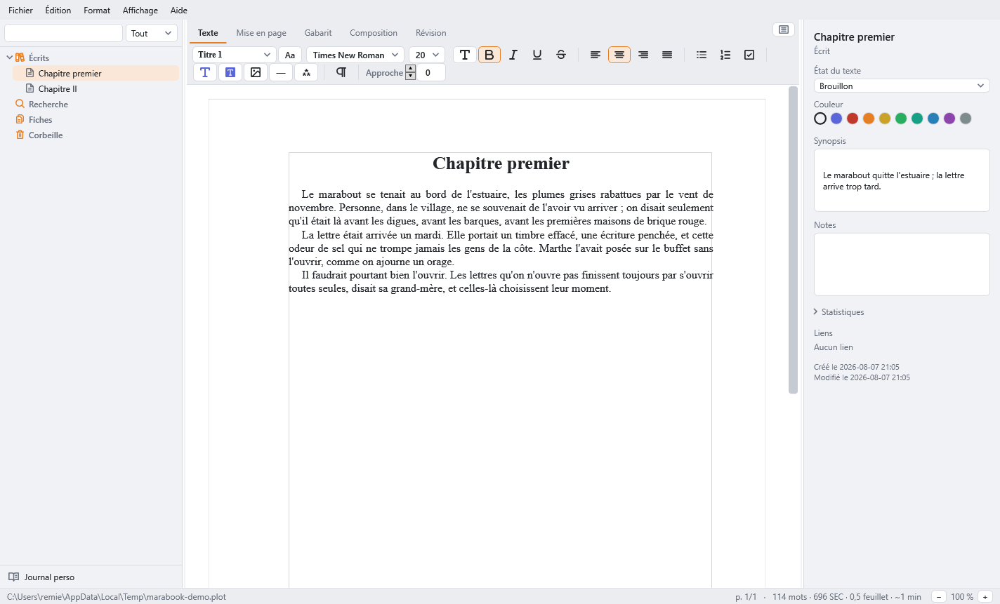

# Marabook

*(English: Marabook is a French-first word processor and book-layout tool for
novelists — think Scrivener + Vellum, open source, zero dependencies, Windows.
The UI is currently French only; the code and its identifiers are in English.)*

Marabook est un traitement de texte et un outil de mise en page **pour le
roman** : on y organise sa bible d'écriture (fiches, dossiers, corkboard), on
y écrit au propre dans de vraies pages, et on en sort un PDF prêt pour
l'imprimeur — polices incorporées, boîtes trim/bleed, traits de coupe,
imposition en cahier. C'est une alternative libre aux outils payants du
créneau (Scrivener, Vellum, Atticus, Papyrus) : gratuit, ouvert, et le format
de projet `.plot` est un simple zip de JSON documenté par le code.



## État : alpha

Le logiciel est **en alpha** (v0.21.x). Il est développé activement et le
format `.plot` est rétrocompatible depuis la v1, mais il n'a pas encore de
version stable. Honnêtement :

**Ce qui marche** — l'éditeur paginé (mode classique et mode Composition
ligne-exacte), les styles de paragraphe à la InDesign (justification à
plages, césure française réglable, enchaînements, veuves/orphelines), les
fiches à modèles et les liens `[[wiki]]`, le corkboard, les livres
(métadonnées, gabarits de pages recto/verso, parties, pages liminaires,
table des matières dynamique), les notes de bas de page au bas de leur page,
les annotations de révision, l'import Scrivener, les exports docx/odt/RTF/
Markdown, l'impression et le **PDF maison** : polices TrueType incorporées et
sous-ensemblées, boîtes trim/bleed, fonds perdus, traits de coupe, sortie
CMJN, imposition en livret, journal d'écriture personnel.

**Ce qui manque encore** — le correcteur orthographique et typographique
(phase 5, prochaine étape), la recherche/remplacement à l'échelle du projet,
les snapshots/versions d'écrits, l'export EPUB (repoussé pré-v1), une vraie
conformité PDF/X (le PDF actuel est de haute qualité mais ne passe pas un
préflight PDF/X — profil ICC et métadonnées XMP au backlog), le kerning et
les ligatures dans le compositeur.

## Compiler

Prérequis : Windows 10/11 avec le .NET Framework 4.8 (préinstallé). Rien
d'autre — pas de Visual Studio, pas de NuGet.

```
build.bat
```

Le script appelle directement `csc.exe` et produit `Marabook.exe`.

## Lancer les tests

```
build-tests.bat
```

Compile les sources avec `tests/` et exécute le harnais maison (round-trip
complet du format `.plot`, algèbre d'édition du pivot, corpus de césure
française scoré, compositeur sur métriques déterministes). Code de sortie
non nul si un test échoue. Règle du dépôt : **tout correctif de bug arrive
avec le test qui l'aurait attrapé.**

## Partis pris techniques

- **Zéro dépendance** : pas de NuGet, pas de `.csproj` ; `csc.exe` direct,
  et le zip/JSON/docx/odt/PDF sont écrits à la main dans `src/`.
- **C# 5 / .NET Framework 4.8 / WPF** : tourne sur tout Windows 10/11 sans
  runtime à installer ; l'UI est construite en code, sans XAML.
- **Un modèle pivot unique** (`src/Model/RichText.cs`) : l'éditeur, le
  `.plot`, les exports et le compositeur parlent tous le même texte.
- **Un écrit = un document** : jamais de manuscrit monolithe en mémoire ;
  la compilation assemble à la volée.
- **Format `.plot` ouvert** : zip + JSON versionné, rétrocompatibilité
  perpétuelle, écriture atomique avec `.bak` roulant.

`PLAN.md` est à la fois la spécification et le journal de réalisation du
projet — c'est la meilleure porte d'entrée pour un contributeur.

## Licence

Le code est publié sous **GPL-3.0** (voir [LICENSE](LICENSE)) : toute
redistribution modifiée doit rester ouverte. L'icône, les visuels et les
polices éventuellement embarquées ont leur propre statut, à clarifier
séparément du code (les icônes d'interface proviennent du jeu
[Phosphor](https://phosphoricons.com/), licence MIT).
